# LOOP — Arquitectura y flujos (por partes)

Documento de referencia del proyecto **eventosloop**.  
Describe la arquitectura actual del código en bloques independientes, sin un único diagrama gigante.

**Última actualización:** mayo 2026  
**Rama de referencia:** desarrollo con UI mock + integración parcial Supabase

---

## Índice

1. [Mapa general de capas](#parte-1--mapa-general-de-capas)
2. [Arranque de la aplicación](#parte-2--arranque-de-la-aplicación)
3. [Autenticación, registro y onboarding](#parte-3--autenticación-registro-y-onboarding)
4. [App de usuario (pestañas y detalle)](#parte-4--app-de-usuario-pestañas-y-detalle)
5. [Eventos, perfil y panel admin](#parte-5--eventos-perfil-y-panel-admin)
6. [Backend previsto (Supabase)](#parte-6--backend-previsto-supabase)
7. [Estado de integración por módulo](#parte-7--estado-de-integración-por-módulo)
8. [Cómo descargar o exportar este documento](#cómo-descargar-o-exportar-este-documento)

---

## Parte 1 — Mapa general de capas

El proyecto sigue una arquitectura **por funcionalidades** (`features/`) con capas simples.  
No hay un gestor de estado global (BLoC/Riverpod); se usan controladores puntuales y servicios.

### Diagrama de capas

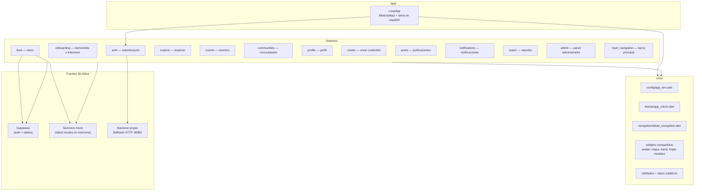

### Convención por funcionalidad

| Carpeta | Rol |
|---|---|
| `views/` | Pantallas Flutter (UI) |
| `controllers/` | Lógica de pantalla, validaciones (`ChangeNotifier`) |
| `models/` | Modelos de datos / DTOs de la UI |
| `services/` | Acceso a datos: mock, Supabase o HTTP |
| `navigation/` | Helpers de navegación del módulo |

### Estructura de carpetas principal

```
lib/
├── app/              → Raíz de la app (LoopApp)
├── core/             → Config, tema, widgets y navegación compartida
└── features/         → Módulos de negocio (auth, feed, events, admin…)
    └── [modulo]/
        ├── views/
        ├── controllers/   (opcional)
        ├── models/
        ├── services/
        └── navigation/    (opcional)
```

---

## Parte 2 — Arranque de la aplicación

### Secuencia de inicio

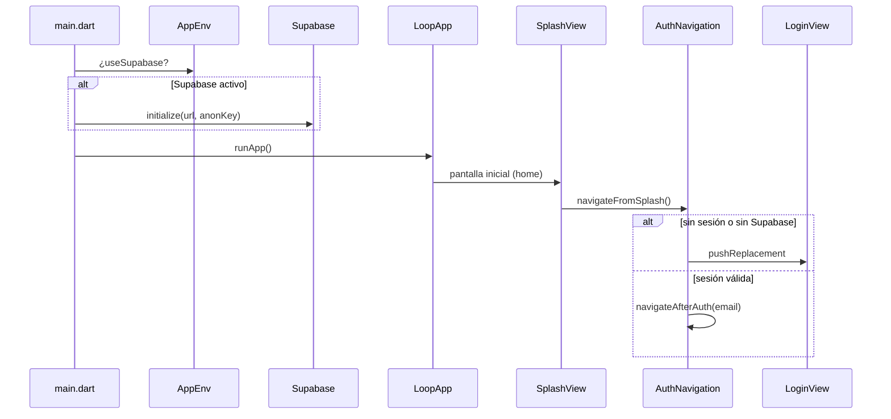

### Puntos clave

| Elemento | Archivo | Descripción |
|---|---|---|
| Punto de entrada | `lib/main.dart` | Inicializa Supabase si aplica y lanza `LoopApp` |
| Raíz visual | `lib/app/loop_app.dart` | `MaterialApp`, locale `es_CL`, tema LOOP |
| Pantalla inicial | `lib/features/auth/views/splash_view.dart` | Decide hacia login o app autenticada |
| Configuración | `lib/core/config/app_env.dart` | URLs, claves, flags Supabase/Google |

**Navegación:** no se usa `go_router`. Todo es **`Navigator` + `MaterialPageRoute`**.

---

## Parte 3 — Autenticación, registro y onboarding

### Flujo completo de auth

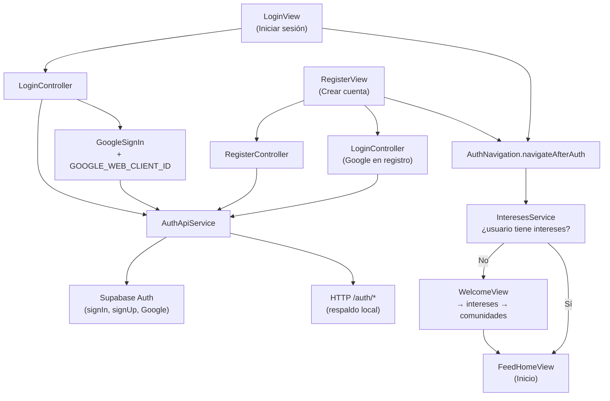

### Pantallas de autenticación

| Pantalla | Ruta en código | Función |
|---|---|---|
| Splash | `auth/views/splash_view.dart` | Comprueba sesión |
| Login | `auth/views/login_view.dart` | Correo + Google |
| Registro | `auth/views/register_view.dart` | Alta manual + Google |
| Olvidé contraseña | `auth/views/forgot_password_view.dart` | Envío de código |
| OTP | `auth/views/otp_verification_view.dart` | Verificación |
| Reset | `auth/views/reset_password_view.dart` | Nueva contraseña |

### Onboarding (primer uso)

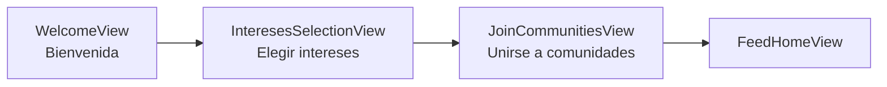

### Variables de entorno relevantes

| Variable | Uso |
|---|---|
| `SUPABASE_URL` | URL del proyecto Supabase |
| `SUPABASE_ANON_KEY` | Clave anónima |
| `GOOGLE_WEB_CLIENT_ID` | OAuth Google (Android + Supabase) |

Ejemplo de ejecución con Google:

```bash
flutter run --dart-define=GOOGLE_WEB_CLIENT_ID=TU_WEB_CLIENT_ID
```

---

## Parte 4 — App de usuario (pestañas y detalle)

### 4a. Navegación principal — barra inferior

La barra vive en `core/widgets/barra_interactiva.dart`.  
La función `navigateFromBar()` está en `features/main_navigation/views/nav_placeholder_view.dart`.

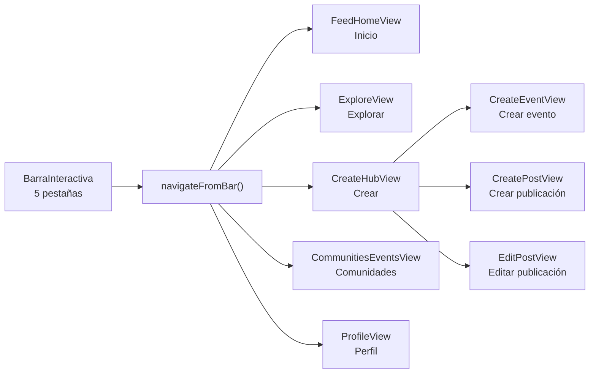

**Comportamiento:** cada pestaña hace `pushReplacement` a su pantalla raíz.  
No hay un `Scaffold` único con `IndexedStack`; cada vista incluye su propia barra.

### 4b. Navegación a detalle (push sobre la pila)

Centralizada en `lib/core/navigation/detail_navigation.dart`:

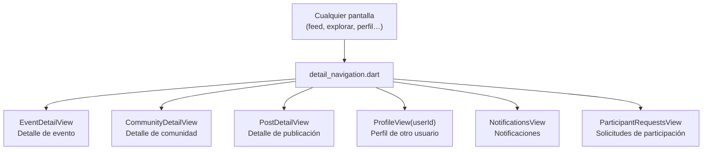

### 4c. Ejemplo de capas — módulo Feed

El feed es el módulo con el patrón de datos más maduro: **facade con fallback**.

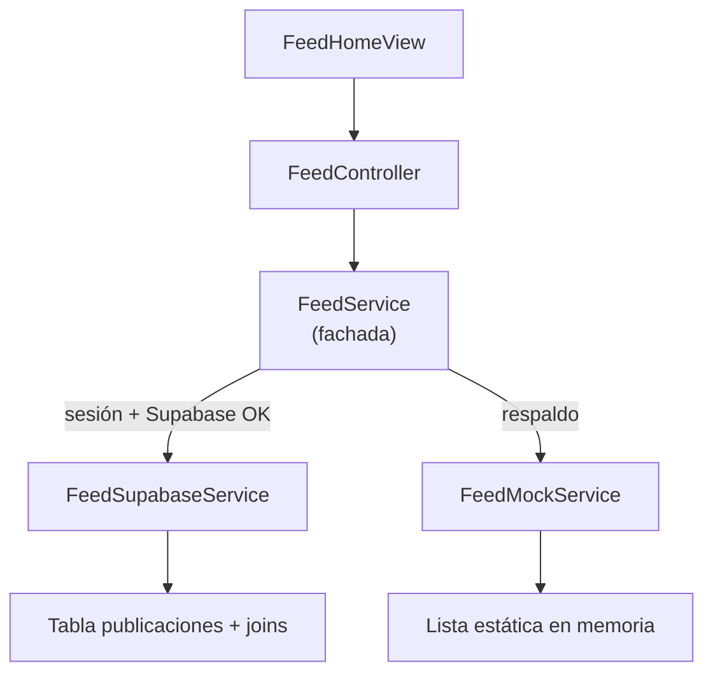

**Orden de intento:** Supabase → si falla → mock (la app no se rompe).

### 4d. Otros módulos de la app usuario

| Módulo | Vista principal | Servicio de datos |
|---|---|---|
| Explorar | `explore/views/explore_view.dart` | `explore_mock_service.dart` |
| Comunidades | `communities/views/communities_events_view.dart` | mock |
| Notificaciones | `notifications/views/notifications_view.dart` | `notification_mock_service.dart` |
| Reportes | `report/views/report_content_view.dart` | `report_content_mock_service.dart` |
| Perfil | `profile/views/profile_view.dart` | `profile_mock_service.dart` |

---

## Parte 5 — Eventos, perfil y panel admin

### 5a. Detalle de evento (incluye rol creador)

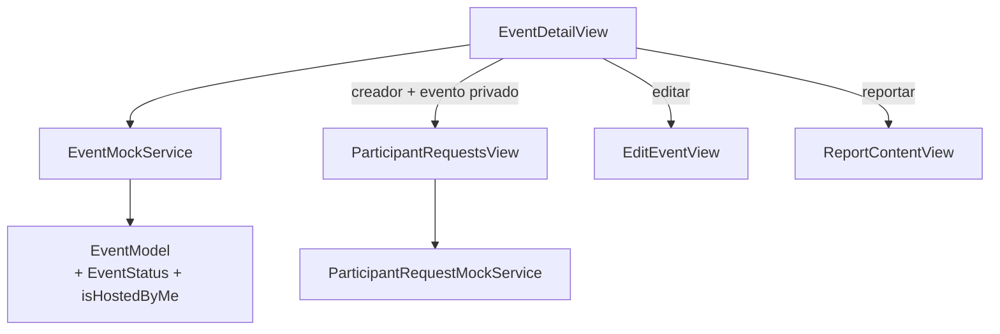

**Estados del evento:** `ACTIVO` · `SUSPENDIDO` · `ELIMINADO`

| Rol | Qué ve |
|---|---|
| Creador | Tarjeta “Gestión del evento”, editar, cambiar estado, solicitudes (si privado) |
| Participante | Botón participar / solicitar según estado y visibilidad |
| Otros | Avisos si está suspendido o eliminado |

### 5b. Perfil y avatar

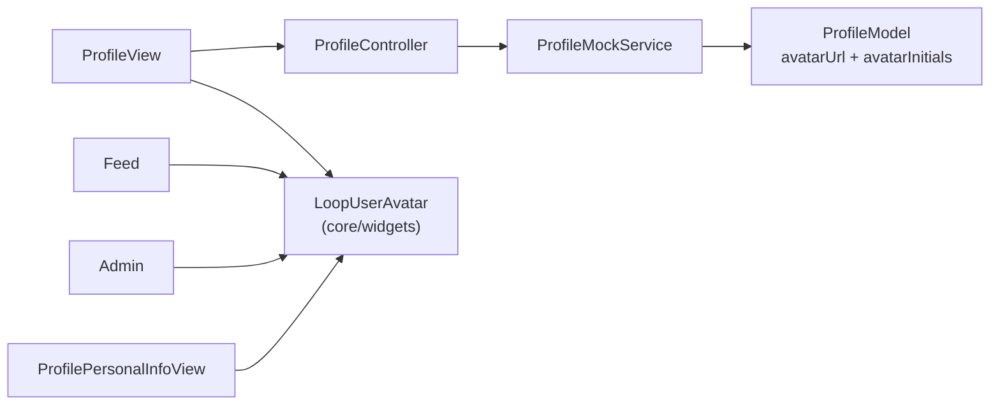

**Regla del avatar:** si existe `avatar_url` → foto de red; si no → iniciales con gradiente LOOP.

### 5c. Panel administrador (módulo separado)

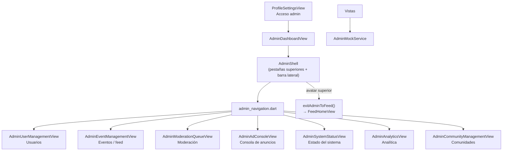

**Notas del admin:**
- Interfaz pensada para **web / pantallas anchas** (`AdminShell` + `LayoutBuilder`).
- Datos 100 % mock por ahora.
- Textos en español.

---

## Parte 6 — Backend previsto (Supabase)

Esquema documentado en `docs/sql/` y `docs/supabase-integracion.md`.

### Relaciones principales

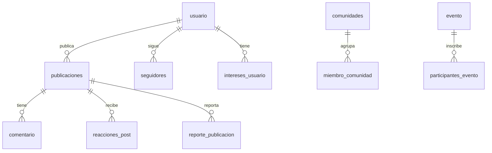

### Scripts SQL disponibles

| Archivo | Contenido |
|---|---|
| `docs/sql/schema_completo.sql` | Esquema global |
| `docs/sql/usuario.sql` | Tabla usuario |
| `docs/sql/evento.sql` | Eventos |
| `docs/sql/comunidades.sql` | Comunidades |
| `docs/sql/publicaciones.sql` | Publicaciones del feed |
| `docs/sql/participantes_evento.sql` | Inscripciones a eventos |
| `docs/sql/roles_sistema.sql` | Roles admin |
| `docs/sql/reporte_publicacion.sql` | Reportes de contenido |

---

## Parte 7 — Estado de integración por módulo

| Módulo | Supabase | Mock | HTTP propio | Notas |
|---|---|---|---|---|
| Auth | Parcial | — | Fallback | Login, registro, Google |
| Feed | Sí (con fallback) | Sí | — | Patrón facade |
| Onboarding / intereses | Parcial | Sí | — | RPC intereses |
| Eventos | No | Sí | — | UI lista, falta backend |
| Explorar | No | Sí | — | |
| Perfil | No | Sí | — | avatar_url preparado |
| Comunidades | No | Sí | — | |
| Notificaciones | No | Sí | — | |
| Admin | No | Sí | — | Solo mock |
| Reportes | No | Sí | — | |

### Fases sugeridas de integración

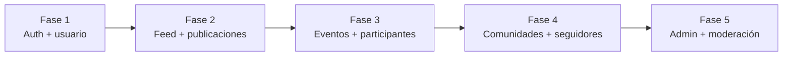

---

## Cómo descargar o exportar este documento

### Opción A — Archivo en el proyecto (recomendada)

El documento ya está en tu repo:

```
eventosloop/docs/arquitectura-flujos-por-partes.md
```

**Ruta completa en tu PC:**

```
c:\Users\Franco\StudioProjects\eventosloop\docs\arquitectura-flujos-por-partes.md
```

Puedes:
- Abrirlo en Cursor / VS Code y usar **Archivo → Guardar como…** en otra ubicación.
- Copiarlo a Drive, correo o GitHub tal cual (Markdown con diagramas Mermaid).

### Opción B — Exportar a PDF

1. Abre el `.md` en **VS Code** con la extensión *Markdown Preview Merged* o *Markdown PDF*.
2. Clic derecho en la vista previa → **Exportar a PDF**.

O bien sube el archivo a [StackEdit](https://stackedit.io/) o [HackMD](https://hackmd.io/) y exporta desde allí.

### Opción C — Ver diagramas renderizados

- **GitHub / GitLab:** al subir el `.md`, los bloques ` ```mermaid ` se renderizan solos.
- **Cursor / VS Code:** vista previa de Markdown (Ctrl+Shift+V).

### Opción D — Presentación animada (recomendada)

Los bloques Mermaid son **código de diagrama**, no video animado. Para verlos con **transiciones entre diapositivas** (efecto presentación):

1. Abre en el navegador (Chrome / Edge):

```
eventosloop/docs/arquitectura-flujos-presentacion.html
```

**Ruta completa:**

```
c:\Users\Franco\StudioProjects\eventosloop\docs\arquitectura-flujos-presentacion.html
```

2. Controles:
   - **← →** cambiar diapositiva (transición animada)
   - **F** pantalla completa
   - **S** auto-reproducir (modo presentación continua)
   - **Esc** salir

3. **Grabar como video:** Windows → Win+G → grabar pantalla mientras avanzas con **S** o las flechas.

4. **Exportar PDF desde el navegador:** Ctrl+P → Guardar como PDF (cada slide = una página si usas impresión por diapositiva).

### Opción E — Animación “real” (flechas en movimiento)

Mermaid **no anima flechas por defecto**. Para eso necesitas llevar el diagrama a otra herramienta:

| Herramienta | Qué hace | Esfuerzo |
|---|---|---|
| [Mermaid Live Editor](https://mermaid.live) | Ver + exportar SVG/PNG | Bajo |
| **FigJam / Figma** | Recrear flujo + Smart Animate | Medio |
| **Canva / PowerPoint** | Aparecer elemento por elemento | Medio |
| **OBS + pantalla** | Grabar la presentación HTML | Bajo |
| **After Effects / Remotion** | Video profesional | Alto |

**Flujo típico:** Mermaid Live → exportar SVG → importar en Figma/FigJam → animar capas o usar modo presentación.

---

## Próximas partes (si quieres ampliar este doc)

| Parte extra | Contenido |
|---|---|
| Auth + Supabase en detalle | Tokens, tablas, Google OAuth paso a paso |
| Feed + publicaciones | Paginación, joins, reacciones, comentarios |
| Eventos + participantes | Estados, solicitudes privadas, WhatsApp |
| Admin + moderación | Cola, reportes, roles |
| Mapa pantalla → pantalla | Inventario completo de rutas de la app |

---

*Documento generado para el equipo LOOP — eventosloop.*
